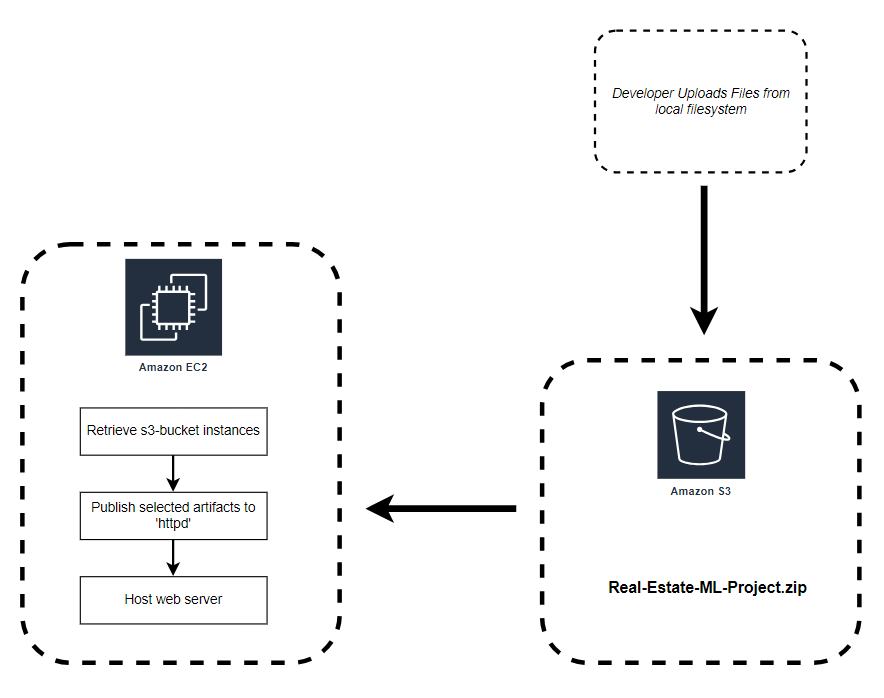
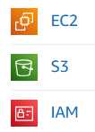
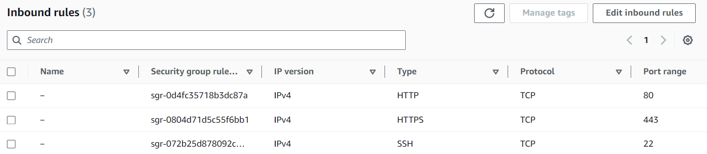
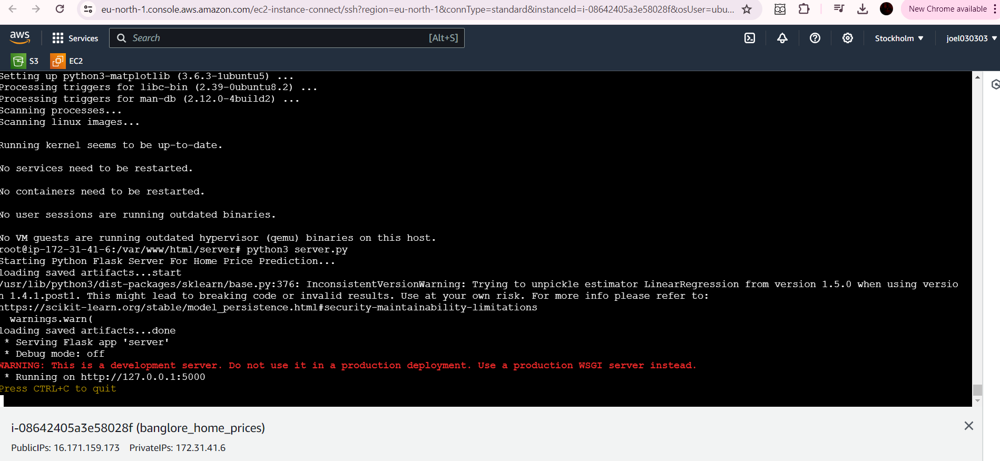

# Real Estate Price Prediction

In the June 2024, I aspired to learn as much as possible about the topic of Machine Learning and Amazon Web Services. This project takes the data from a CSV with attributes such as `location`, `size`, `total_sqft` and `price`, all representative of real-estate indicators of the price. Then, this data is used to build a machine learning model that takes several attributes indirectly indicative of the price, and predicts a price.


**Demo:**


## Architecture



Since the project revolves around the services provided my Amazon (AWS), the input dataset needs to be uploaded to your S3 bucket, which then is retrieved by the EC2-instances. The EC2 service also has the responsibility of running the nodes that your application is relying for successful execution. In other words, they are hosting the project on the cloud.

I also experimented with the cloud shell in the AWS management console, as well as the shells specific to the EC2 instances. I selected Ubuntu as the operating system since I was familiar with it due to my prior team-management project [Cyber Physical Systems of Systems](https://gitlab.com/jex-projects/mrjex/-/tree/main/projects/1.%20courses/year-2/7.%20Cyber%20Physical%20Systems%20and%20Sytems%20of%20Systems?ref_type=heads)


### Flask

I used a Python Flask server as the backend component that responds on requests of the client. I had some previous experience with Flask from my [Software Quality & Testing](https://gitlab.com/jex-projects/mrjex/-/tree/main/projects/1.%20courses/year-2/6.%20Software%20Quality%20%26%20Testing?ref_type=heads) course, where we worked with a small database and limited operations in a Flask layer. In addition, I noticed a similarity with the Flask server I implemented in this project and a server I created in an earlier course called [Web Development](https://gitlab.com/jex-projects/mrjex/-/tree/main/projects/1.%20courses/year-2/1.%20Web%20Development/bookster-project?ref_type=heads). Both servers serve as the backend component with a stateless HTTP and URL structure, making them RESTful APIs.


### Jupyter Notebook

In the `.ipynb` file I created a new data frame for each step in the data processing pipeline and used Standard Deviation and deleted the outmost deviations to remove the outliers for a more accurate Linear Regression analysis.


### Linear Regression

Linear Regression is a vital concept in statistics and predictive analysis. Being able to examine datapoints in a two-dimensional axis and bring forth a generality covering all instances is a powerful concept. By virtue of the interpretation of data and suggesting actionable measures that are accurate and beneficial, one must look at data through the lens of generalities. Being able to see data for what it is, and viewing it from a bigger picture, understanding that the impact of outliers and the prowess of the apparent trend that Linear Regression presents to its users creates opportunities for growth in every concievable are that are measurable within two axis, X and Y.

Before I started this project, I had experience with this profound concept in these projects:

- [Cyber Physical Systems of Systems](https://gitlab.com/jex-projects/mrjex/-/tree/main/projects/1.%20courses/year-2/7.%20Cyber%20Physical%20Systems%20and%20Sytems%20of%20Systems?ref_type=heads)

- [Relational-Analysis-And-Visualization](https://gitlab.com/jex-projects/mrjex/-/tree/main/projects/2.%20spare-time/2.%20Relational-Analysis-And-Visualization?ref_type=heads)


#### K Fold cross validation

Measures the accuracy of Linear Regression. In this project when I applied it on the Linear Regression, I used 5 splits and got > 80% on all of them.


#### GridSearchCV

API from SKLEARN that runs your model on different regressors and parameters. It finds the best model or algorithm with the optimal parameter configuration:


## Amazon Web Services

One of my main objectives when I started this project was to get practical AWS experience. Below are a few of my takeaways from this project:





**EC2:** A virtual Machine in a cloud that performs cloud computations

**S3:** Store artifacts in the cloud that can be accessed by other services during runtime

**IAM:** Using and modifying permissions to specific services

**General:** Many services in general are dependent on the Inbound/Outbound rules. Manually altering HTTPS, HTTP and SSH ports is imperative





### Dependencies

The process of establishing the dependencies may be complex. Here are a few noteworthy commands that may solve your encountered issue:

1. Connect SSH client to the Ubuntu environment in the EC2-instance:

- *You need a `.pem` file with a private auth key*
- *You need to input your personal path to that `.pem` file*
- *You need to alter the public ip-address to yours*
- *You need to alter the AWS region to yours*

`ssh -i "C:\Users\joel0\.ssh\banglore_home_prices_key.pem" ubuntu@ec2-16-171-159-173.eu-north-1.compute.amazonaws.com`


2. Install dependencies

```
sudo pip3 install -r requirements.txt --break-system-packages
sudo apt install -y python3-numpy
sudo apt install python3-venv
sudo apt-get update -y
sudo apt-get install -y python3-flask
```

3. Run AWS Ubuntu Shell


